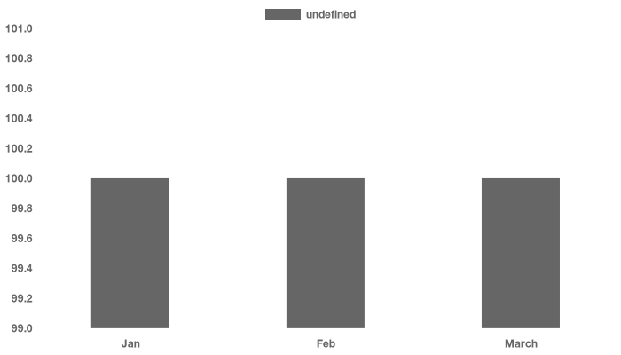
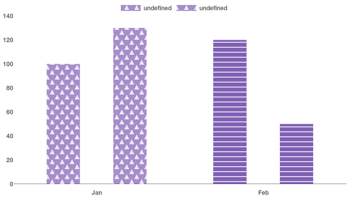

# Chart Generator

<p align="center">
<a href="https://packagist.org/packages/square1/chart-generator"></a>
<a href="https://packagist.org/packages/square1/chart-generator"></a>
<a href="https://packagist.org/packages/square1/chart-generator"></a>
</p>

## Install

Via composer

```shell
$ composer require square1/chart-generator
```

From Laravel 5.5 uses Package Auto-Discovery, so doesn't require you to manually add the ServiceProvider and Facade.

If you don't use auto-discovery, add the ServiceProvider to the `providers` array in **config/app.php**

```php
    'providers' => [
        // ...
        Square1\ChartGenerator\ServiceProvider::class
    ]
```

And add the alias into `aliases`

```php
    'aliases' => [
        // ...
        'ChartGenerator' => Square1\ChartGenerator\Facade::class
    ]
```

## Configuration

By default, the package uses the following environment variables to auto-configure the plugin without modification:

```dotenv
CHART_SERVICE_URL=
CHART_SERVICE_KEY=
CHART_SERVICE_SECRET=
```

## Usage

Generate a 700x400 bar chart as [Intervention image](http://image.intervention.io/use/basics).

```php
/** @var \Intervention\Image\Image $image */
$image = ChartGenerator::createChart('bar', 700, 400, ['Jan' => 100, 'Feb' => 100, 'March' => 100], [/* See options section */]);
```

### Options

Chart.js allows some options to configure and personalize the chart. This is the current list of features available:

| Option | Type | Default | Description |
|:------ |:---- |:------- |:----------- |
| title | string or false | false | Show a title on the middle of chart or not |
| showValues | bool | false | Show the values on the chart |
| beginAtZero | bool | false | If true, scale will include 0 if it is not already included |
| stepSize | int | - | User defined fixed step size for the scale |
| legend | bool | true | Show the legend on the chart |
| format | string | - | Allow format the values. Currently the options available are: `money` |
| currency | string | - | Currency used if the format is `money` |
| color | string or array | rgba(0, 0, 0, 0.1) | Background color for the chart. It's possible define an array with different colors and patterns. See on examples |

## Examples

* 700x400 bar chart

```php
/** @var \Intervention\Image\Image $image */
$image = ChartGenerator::createChart('bar', 700, 400, ['Jan' => 100, 'Feb' => 100, 'March' => 100], []);
```




* 700x400 bar chart with a pattern

```php
/** @var \Intervention\Image\Image $image */
$image = ChartGenerator::createChart('bar', 700, 400, ['Jan' => 100, 'Feb' => 100, 'March' => 100], ['color' => ['pattern' => 'line', 'color' => 'rgba(74, 29, 150, 0.7)']]);
```


* 700x400 bar chart with multiple dataset and pattern

```php
/** @var \Intervention\Image\Image $image */
$image = ChartGenerator::createChart('bar', 700, 400, ['Jan' => [100, 120], 'Feb' => [130, 50]], ['beginAtZero' => true, 'color' => [['pattern' => 'triangle', 'color' => 'rgba(74, 29, 150, 0.5)'], ['pattern' => 'line', 'color' => 'rgba(74, 29, 150, 0.7)']]]);
```


